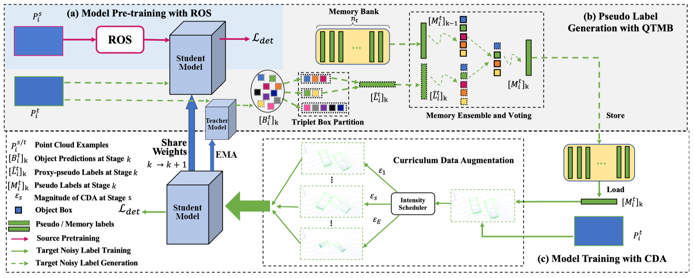

# ST3DMT

This project is based on the work of  [**ST3D: Self-training for Unsupervised Domain Adaptation on 3D Object Detection**](https://arxiv.org/pdf/2103.05346), CVPR 2021

## Introduction

Our code is based on [OpenPCDet v0.2](https://github.com/open-mmlab/OpenPCDet/tree/v0.2.0). 
Deep learning models trained on annotated datasets (source domain) are often observed with considerable accuracy decrease on other datasets (target domain). However, retraining the model on the target domain is of great cost. To achieve efficient domain adaptation, we use self training to modify the pesudo labels generated by the source domain. But there exists noise during self training, which makes training less effective. Our research objective is to reduce the noise caused by self training. By amending the structure of ST3D with Mean-teacher paradigm, we achieve considerable increase on the detection of 3D objects.

### nuScenes -> KITTI TASK
|                                             | method | Car@R11 | Car@R40 |
|---------------------------------------------|----------:|:-------:|:-------:|
| [PV-RCNN](tools/cfgs/da-nuscenes-kitti_models/pvrcnn/pvrcnn_old_anchor.yaml) | Source Only | 37.13 | 33.24 |
| [PV-RCNN](tools/cfgs/da-nuscenes-kitti_models/pvrcnn_st3d/pvrcnn_st3d.yaml) | ST3D | 42.3 | 40.9 |
| [PV-RCNN](tools/cfgs/da-nuscenes-kitti_models/pvrcnn_st3d/pvrcnn_st3d.yaml) | **ST3DMT** | **69.53** | **68.48** |

For more detailed information, please refer to our [project paper](docs/project.pdf)

## Installation

Please refer to [INSTALL.md](docs/INSTALL.md) for the installation.

## Getting Started

Please refer to [GETTING_STARTED.md](docs/GETTING_STARTED.md) to learn more usage about this project.

## Acknowledgement

Our code is heavily based on [OpenPCDet v0.2](https://github.com/open-mmlab/OpenPCDet/tree/v0.2.0). Thanks OpenPCDet Development Team for their awesome codebase.
